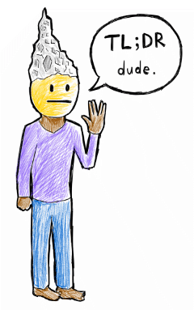

# TLDR Guide To Personal Digital Security

## About

### Who's this for?

- You're pretty tech-savvy and you're comfortable going into the settings section of your computer/smartphone.
- You've read 1-2 guides for personal digital safety/privacy but are not sure about which recommendations you need to follow.
- You're not in immediate danger. So if something is really complicated to set up and maintain, chances are it's not for you. (Usability matters!)

### How this works

- This guide is a living document – please feel free to submit a pull request and/or fork your own version of this guide.
- **I would recommend doing everything in levels one and two.** I did, and I'm only a mildly technically-competent person.

### Last updated

19 November 2018

---

## Theory

### Threat Modeling

- What kind of danger are you in? E.g. corporate espionage, police/state intervention, online harassment/doxing.
- What kind of assets are you protecting? E.g. confidential documents, private photos.
- We're all in a little bit of danger (otherwise we wouldn't bother putting a password on our computers and phones) but it's important to think about what's at stake before dismissing concerns or becoming paranoid :)
- For more info, read [the EFF's introduction to threat modeling](https://ssd.eff.org/en/module/introduction-threat-modeling).

### Weakest Link

- Remember the weakest link is all that matters! E.g. if password recovery is linked to email, then hackers only need to get access to your email.
- For more info, read [the EFF's guide to seven steps to digital security](https://ssd.eff.org/en/module/seven-steps-digital-security).

---

## Science

### Encryption levels

1. Not encrypted: Any third party who intercepts the data can read it as-is.
2. Regular encryption: Data is encrypted so that third parties cannot read them. But the platform (e.g. Google or Facebook) still has access, and may hand the data over to law enforcement if they are required to do so by the courts/the government.
3. End-to-end encryption: the data can only be read by the original sender and receiver. This means not even the platform has access. So if law enforcement calls, the service provider can't hand over the messages because they don't have them either.

### Metadata

Data about your data – e.g. what number you called, and for how long (but not the contents of the call). With enough metadata, hackers can piece together a pretty good picture of who you are, who you know, where you're going, etc. Plus legal protections around metadata are generally weaker.

---

## Level 1 💦

### Things To Do Now

#### Email

- If you're on a webmail service, check that you're logging into it using an `https://` URL. And if there isn't one, find a new email provider.
- Turn on two-factor authentication for your email service (e.g. [Gmail instructions](https://support.google.com/accounts/answer/185839?hl=en)) **if** they support an authenticator app (SMS is no longer considered safe) (e.g. [Google Authenticator](https://support.google.com/accounts/answer/1066447?hl=en), [DUO Mobile](https://duo.com/product/trusted-users/two-factor-authentication/duo-mobile), [Authy](https://authy.com/)).

#### Good passwords

- Any password less than 10 characters is bad, but it's also okay-to-string-together-non-sequitur-words.
- Double check the security questions for your key online services (email, bank, Facebook, etc.) and make sure that they're not easy to answer by friends/looking you up on Google.
- Use a different password for every service, because password leaks happen all the time. To make this easy, use a password manager – [Lifehacker reviews them here](https://lifehacker.com/5529133/five-best-password-managers). They also help generate more secure passwords.
- Use a non-common/obvious unlock code for your phone.
- If you use thumbprint (or facial recognition) unlock, immediately power off your phone if you're ever arrested. In the US, [officers can compel you to provide your fingerprint but not your passcode](http://www.theatlantic.com/technology/archive/2016/05/iphone-fingerprint-search-warrant/480861/). (The latter is protected by the Fifth Amendment – people have a right not to testify against themselves.)

#### Encrypt your devices

- Encrypt your phone storage: [Android](http://www.networkworld.com/article/2689371/opensource-subnet/how-to-encrypt-an-android-device-in-5-steps.html), [iOS](https://ssd.eff.org/en/module/how-encrypt-your-iphone
) (many phones now encrypt by default but it's worth double checking).
- Encrypt your laptop/desktop hard drive: [Windows](https://uit.stanford.edu/service/encryption/wholedisk/bitlocker), [Windows if no BitLocker](https://veracrypt.codeplex.com/), [Mac OSX](https://support.apple.com/en-us/HT204837).
- Secure your backups too! Encrypt your backup hard drives and/or make sure your online backup storage solution supports end-to-end encryption.
- N.B. Remember encryption is only fully effective when the device is off!

#### Other

- Turn off app-specific passwords that bypass two-factor authentication (e.g. [instructions for Gmail](https://www.lifewire.com/revoke-an-application-password-for-gmail-1171889)).
- [Turn on Login Alerts on Facebook](https://www.facebook.com/settings?tab=security).
- Setup up a pin code for your mobile phone SIM card: [iPhone](https://support.apple.com/en-hk/HT201529), [Android](https://www.digitalcitizen.life/how-change-or-remove-sim-pin-android-2-steps). Search your phone provider's website to find out what their default password is (it varies from carrier to carrier).
- [Disable macros within Microsoft Office](https://support.office.com/en-us/article/enable-or-disable-macros-in-office-files-12b036fd-d140-4e74-b45e-16fed1a7e5c6).

### Habits to Cultivate

#### Email

- Be on the lookout for phishing scams: where possible double check the _From_ email address and the domains that outbound links go to.
- Don't open unnecessary email attachments. Where possible, open/preview them first in an online document reader, or have colleagues use a filesharing server or service (Google Drive, SpiderOak, Dropbox), which tend to be a little harder to hack into.
- You can upload a suspicious attachment to [VirusTotal](http://www.virustotal.com) for a check-up (but keep in mind files submitted to VirusTotal are available to security researchers so don’t submit sensitive information).

#### Update all the things

- When you get a notification to update your operating system (on your mobile or computer), do it right away.
- Same for apps (mobile + computer).
- Check occasionally for firmware updates for your router (and other Internet-connected devices).

#### Other

- Change important passwords (e.g. email, computer login, password manager master) every year or two.
- Wipe your devices properly before donating/giving away: [phone](http://lifehacker.com/5808280/what-should-i-do-with-my-phone-before-i-sell-it), [computer](http://lifehacker.com/5835369/how-do-i-securely-wipe-a-computer-before-donating-it-to-charity).
- Don't charge your phone at public charging stations/ports – they may steal your data.

### Scenario: 💩 my phone/computer was stolen!

- Follow the Freedom of Press Foundation's guide: [What To Do If Your Phone Is Seized By The Police](https://freedom.press/training/mobile-security-for-activists-and-journalists/).
- Wipe your phone remotely: see instructions for [Android](https://support.google.com/accounts/answer/6160491?hl=en), [iOS](https://support.apple.com/kb/PH2701?locale=en_US).

### Scenario: I think my computer has been hacked 😱

- Download an application that will notify you when data is being sent out from your computer. E.g. [Little Snitch for Mac](https://www.obdev.at/products/littlesnitch/index.html).
- Run Activity Monitor on Mac or Process Explorer on Windows to look at what processes/applications are running. Google any suspicious names.
- Login to important online accounts to see if there have been any suspicious logins – see [this Motherboard guide for details](https://motherboard.vice.com/en_us/article/bjeznz/how-do-you-know-when-youve-been-hacked-gmail-facebook).

---

👍 Good job! You've covered the basics. What about trying out the next level?

---

## Level 2 💦💦

### Things To Do Now    

- Review the privacy settings on social networks you frequent: who can see your content, who can comment on it, and who can see your location.
- Review what's connected to your main email/social media accounts (e.g. what kinds of services have access to Facebook, and what data can they access and/or can they post on your behalf).
- Set up your devices with third-party applications (e.g. [Lookout Security](https://www.lookout.com/), [Prey](https://www.preyproject.com) so you can remotely track, wipe, and encrypt your devices from a website in the future.
- Setup end-to-end encryption for computer-based instant messaging: EFF guide for [Mac](https://ssd.eff.org/en/module/how-use-otr-mac), [Windows](https://ssd.eff.org/en/module/how-use-otr-windows), [Linux](https://ssd.eff.org/en/module/how-use-otr-linux).
- Review the extensions/add-ons/plug-ins that have been installed within your computer web browser – delete any that you haven't used in a while or don't remember installing.

### Habits To Cultivate

- Post less personal information online – especially information that can be used to identify/track/scam you (addresses, phone numbers, birthday, etc.). Remember almost everything you say online is logged somewhere and that even if your setup is secure, your recipient's setup may not be.
- Use a paid VPN service when on public networks (e.g. cafe wifi) – free VPN services are bad because operators don't have enough incentive to protect you/your data. See this Freedom of the Press' [guide to choosing VPNs and their five recommendations](https://freedom.press/training/choosing-a-vpn/).
- Start using [Signal](https://whispersystems.org/), an end-to-end encrypted mobile messaging app that's generally agreed to be safe/secure/robust. (Beyond Signal, there is little consensus on what's secure and people tend to get very emotional about their choice of mobile messaging apps.)
- Start making end-to-end encrypted voice calls (available on Signal, WhatsApp, Jitsi, Silent Phone, Zphone, etc.).
- If you ever need to send someone a password, split it in half and send via two different channels (e.g. email + voice call).
- Buy more secure mobile phones ($$$): either an iPhone or an Android phone that implements a "pure" Google version of Android (at the least you should be able to go to Settings → Security and see options for encryption and SIM card lock).
- If you own domains, use WHOIS privacy services and stick with it (they're worth the money). But note that with WHOIS lookup/history tools, if you've ever put in your real address, it's very difficult to remove from the logs.

### Scenario: Online harassment & doxing

- See [Feminist Frequency's Speak Up & Stay Safe(r)](https://onlinesafety.feministfrequency.com/en/).
- See [Crash Override: So You've Been Doxed](http://www.crashoverridenetwork.com/soyouvebeendoxed.html).
- See [Crash Override: Preventing Doxing](http://www.crashoverridenetwork.com/preventingdoxing.html).
- See [Equity Labs: Anti-Doxing Guide for Activists Facing Attacks from the Alt-Right](https://medium.com/@EqualityLabs/anti-doxing-guide-for-activists-facing-attacks-from-the-alt-right-ec6c290f543c).
- Use [Traveling Mailbox](https://travelingmailbox.com/) to obscure your postal address.
- Use [Burner](http://www.burnerapp.com/) to set up burner phone numbers for calling/texting.
- Pay [PrivacyDuck](https://www.privacyduck.com/) to scrub your information online. If you are an activist you can contact [Equity Labs](https://medium.com/@EqualityLabs/anti-doxing-guide-for-activists-facing-attacks-from-the-alt-right-ec6c290f543c) for a discounted rate.
- Pay [Reputation.com](https://www.reputation.com/) to remove your information from paid sites and monitor them to make sure it stays removed.
- Alternately, both [PrivacyDuck](https://www.privacyduck.com/resources/) and [Motherboard](https://motherboard.vice.com/en_us/article/ne9b3z/how-to-get-off-data-broker-and-people-search-sites-pipl-spokeo) have free online resources to help you remove your information yourself.
- Reach out to online communities you're an active member of and ask for help. See [PEN America's article on Deploying Your Supportive Cyber Communities](https://onlineharassmentfieldmanual.pen.org/cyber-safety/deploying-your-supportive-cyber-communities/).

### Scenario: Attending a protest

- Draft a message to a trusted friend who is elsewhere. Be ready to hit Send if you are arrested/there is an emergency.

### Scenario: Sexting & revenge porn

- See [The Motherboard Guide to Sexting Securely](https://motherboard.vice.com/en_us/article/mb3nd4/how-to-sext-securely-safely-what-apps-to-use-sexting).

---

🎉 Congratulations! You're now reasonably secure, which is more than most :)

---

## Level 5 💦💦💦💦💦 (a work-in-progress)

- Buy a [YubiKey](http://www.amazon.com/Yubico-Y-072-YubiKey-NEO/dp/B00LX8KZZ8/ref=sr_1_1?ie=UTF8&qid=1421839152&sr=8-1&keywords=yubikey+NEO) USB key to use for two-factor authentication.
- Fortify your self-hosted Wordpress website with [Cloudflare](https://www.cloudflare.com) + [iThemes Security](https://wordpress.org/plugins/better-wp-security/).
- Keep your personal information off the Internet: Google your own name, phone number and address to see what comes up, and contact the respective sites to remove your details.
- Delete old accounts to eliminate traces of personal information on the Internet. Use [Justdelete.me](http://Justdelete.me) + [Have I Been Pawnd](https://haveibeenpwned.com/) to accelerate this process.
- Keep less information/data/photos on your devices – you can't lose what you don't have!
- Don't use Google/Twitter/Facebook to sign up/login to other services – each service should have its own account.
- Encrypt emails with PGP: [Mac OSX](https://ssd.eff.org/en/module/how-use-pgp-mac-os-x),[Windows](https://ssd.eff.org/en/module/how-use-pgp-windows), [Linux](https://ssd.eff.org/en/module/how-use-pgp-linux).
- If PGP email is too much of a hassle, sign up for a [Protonmail](https://protonmail.com/) or [Tutanota](https://tutanota.com/) email account.
- Use an adblocker on your computer and mobile.
- Search the web anonymously with [DuckDuckGo](http://duckduckgo.com/).
- Set up a fenced off, secure OS: [Tails](https://ssd.eff.org/en/module/keeping-your-data-safe).
- If you're crossing the border into a country with a track record of seizing travelers' data **and** you're carrying highly sensitive information – see [Wired's guide](https://www.wired.com/2017/02/guide-getting-past-customs-digital-privacy-intact/) and [BoingBoing's addendum](http://boingboing.net/2017/02/12/how-to-cross-a-us-or-other-b.html) about making data unavailable, setting up burner accounts, and filing for attorney privileges at the border.
- If you're attending a high-risk protest: leave your phone at home or use burner phone. More info from the EFF about protesting [in the US](https://ssd.eff.org/en/module/attending-protests-united-states
), and [internationally](https://ssd.eff.org/en/module/attending-protests-international).
- Don't put any stickers on your laptop or phone that could be mistaken as a hacking and/or political organization – it might get you stopped at the border one day.
- [Generating Diceware passwords](http://world.std.com/~reinhold/diceware.html).
- If you're a journalist who uses Signal regularly, step up your safety practices try following Martin Sheldon's [Locking Down Signal](https://medium.com/@mshelton/locking-down-signal-d71678f653d3) guide (or [similarly for WhatsApp](https://medium.com/@mshelton/upgrading-whatsapp-security-386c8ce496d3) if you use that a lot).
- If you're a public figure/writer/artist, consider working under a persistent pseudonymn or collective identity – this [Tactical Tech manual](https://gendersec.tacticaltech.org/wiki/index.php/Complete_manual#Creating_and_managing_identities_online) has more details on that.

---

Oh my you made it this far! You are a true 🏆!

---

## Sources

These are the main sources that I drew from, all of which were tremendously helpful and are good guides in their own right:

- [Digital Security Low Hanging Fruit](https://www.johnscottrailton.com/jsrs-digital-security-low-hanging-fruit/) by John Scott-Railton
- [Computer Security Tools and Concepts for Lawyers](https://papers.ssrn.com/sol3/papers.cfm?abstract_id=2831739) by Kendra Albert
- [Crash Override's Resource Center](http://www.crashoverridenetwork.com/resources.html)
- [The Electronic Frontier Foundation's Surveillance Self-Defense](https://ssd.eff.org/)
- [How to encrypt your entire life in less than an hour](https://medium.freecodecamp.com/tor-signal-and-beyond-a-law-abiding-citizens-guide-to-privacy-1a593f2104c3#.z1estrrkj) by Quincy Larson
- [Anti-Doxing Guide for Activists Facing Attacks from the Alt-Right](https://medium.com/@EqualityLabs/anti-doxing-guide-for-activists-facing-attacks-from-the-alt-right-ec6c290f543c) by Equity Labs
- [The Motherboard Guide to Not Getting Hacked](https://motherboard.vice.com/en_us/article/d3devm/motherboard-guide-to-not-getting-hacked-online-safety-guide)

Let me know by filing an issue if there are any other guides that you found useful that you think I should include.

---

## License

This work is licensed under a [Creative Commons Attribution-NonCommercial-ShareAlike 4.0 International License](http://creativecommons.org/licenses/by-nc-sa/4.0/).
